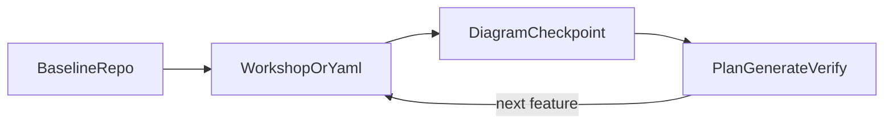

# Crablet Greenfield

This skill is the entry point when the user asks how to start a Crablet app from scratch or wants
help pacing the whole lifecycle. It coordinates existing depth skills; it does not replace their
playbooks.

## Routing

| Phase | Use |
|-------|-----|
| App bootstrap and baseline | `crablet-greenfield`, then `crablet-local-dev` if local setup fails |
| Event Modeling conversation and YAML shape | `crablet-event-modeling` |
| Diagram checkpoint, actor/lane metadata, renderer vocabulary | `crablet-diagram-advisor` |
| Plan, generate, repair, and slice implementation | `crablet-app-dev` |
| Provider config, artifact ownership, repair-cycle failures | `crablet-codegen` |
| DCB pattern, tags, guard events, concurrency diagnosis | `crablet-dcb` |
| Local Kubernetes after `deployment:` stabilizes | `crablet-k8s` |

## Phase A - Repo And Runtime Baseline

Preferred path: copy `templates/crablet-app`, install framework artifacts when they are not yet
published, build `embabel-codegen.jar`, and place it under the app's `tools/` directory. Align the
exact setup with `docs/user/CREATE_A_CRABLET_APP.md`, `docs/user/BUILD.md`, and
`templates/crablet-app/README.md`.

Alternative path: use Spring Initializr or `curl` to create a Spring Boot app, then wire Crablet
manually from `docs/user/CREATE_A_CRABLET_APP.md`.

Phase A is done when:

- the app is a clear repo boundary separate from `spring-crablet`
- Java 25 and PostgreSQL are available
- `./mvnw verify` can run from the app root
- Claude Code/Cursor MCP or Makefile commands are understood
- `make plan`, `make generate`, `make verify`, and `make diagram-preview` are available in the app

## Phase B - Model

Use `crablet-event-modeling` for workshop dialogue. The output is `event-model.yaml`: the structural source
of truth for generated Spring code. For small, unambiguous changes, direct YAML edits are acceptable,
but the assistant should still ask for missing business facts.

After substantive user input or any model-affecting YAML edit, run the diagram checkpoint:

1. From the app root, run `make diagram-preview`.
2. Open or summarize `diagram-preview.html`.
3. Check the full picture: actors, lanes, commands, events, views, automations, and outbox overlays.
4. Use `crablet-diagram-advisor` if `diagram.*`, lane assignments, sidecar overlays, or renderer
   behavior needs adjustment.

## Phase C - Land One Slice

Use `crablet-app-dev` for the feature-slice loop:

1. Clarify the outcome and missing facts.
2. Update `event-model.yaml`.
3. Run the diagram checkpoint when the model changed.
4. Run `make plan` or `embabel_plan` and review artifacts.
5. Ask for approval before `make generate` or `embabel_generate`.
6. Generate with output set to `src/main/java` in starter apps.
7. Implement user-owned behavior behind generated structural boundaries.
8. Run `make verify` or `./mvnw verify`.

Prefer fixing structural gaps in `event-model.yaml` over hand-editing generated framework-shaped
code.

## Phase D - Evolve The App

Treat every new capability as another vertical slice. Return to Phase B for the model delta, then
Phase C for plan, generate, implementation, and verification.

When adding `views:`, `automations:`, or `outbox:`, confirm the required Maven modules and runtime
wiring. Poller-backed modules process at least once, so views, automations, and publishers must be
idempotent. For production topology, point to `docs/user/DEPLOYMENT_TOPOLOGY.md`; command-only apps
scale horizontally, while poller-backed modules need the documented singleton-worker shape.

Use `crablet-dcb` whenever command consistency, tags, `guardEvents`, or conflict behavior are not obvious.
Use `crablet-k8s` after the `deployment:` block is stable enough to generate local manifests.

