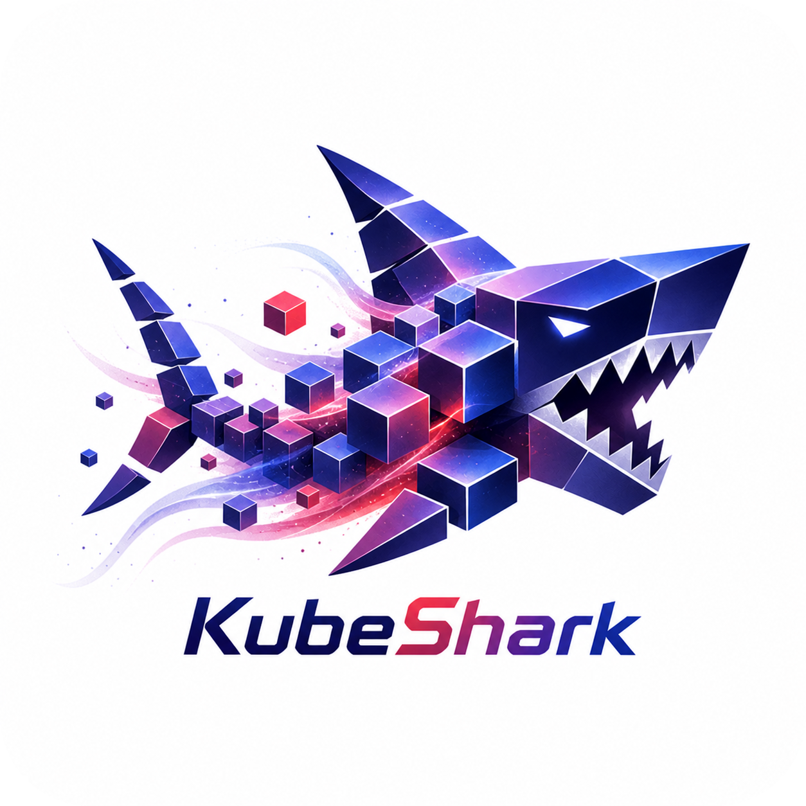

# Kubernetes Skill for Claude Code and Codex: KubeShark

<div align="center" name="top">
  

<!-- spacer -->
<p></p>

[](https://docs.claude.ai/docs/agent-skills)
[](https://developers.openai.com/codex/skills/)
[](https://opensource.org/licenses/MIT)
[](https://github.com/LukasNiessen/kubernetes-skill)

</div>

The #1 Kubernetes skill for Claude Code and Codex, measured by GitHub stars.

### Fixes Hallucinations.

LLMs hallucinate a lot when it comes to Kubernetes. They omit security contexts, generate deprecated APIs, use wildcard RBAC, forget resource limits, and produce probes that cause cascading failures. This skill fixes it. It includes best practices for Kubernetes -- good, bad, and neutral examples so the AI avoids common mistakes. Using KubeShark, the AI keeps proven practices in mind, eliminates hallucinations, and defaults to secure, reliable, production-ready manifests.

KubeShark is built as the production-grade Kubernetes skill for Claude Code and Codex: broader than resource-template skills, safer than generic Kubernetes prompts, and tuned for hallucination prevention instead of raw tutorial volume.

### Very Token-Efficient.

Most Kubernetes skills dump huge walls of text onto the agent and burn expensive tokens -- with no upside. LLMs don't need the entire Kubernetes docs again. KubeShark was aggressively de-duplicated and optimized for maximum quality per token.

### Based on Official Best Practices.

KubeShark is primarily based on the [official Kubernetes documentation](https://kubernetes.io/docs/), the [NSA/CISA Kubernetes Hardening Guide](https://media.defense.gov/2022/Aug/29/2003066362/-1/-1/0/CTR_KUBERNETES_HARDENING_GUIDANCE_1.2_20220829.PDF), [OWASP Kubernetes Top 10](https://owasp.org/www-project-kubernetes-top-ten/), [Pod Security Standards](https://kubernetes.io/docs/concepts/security/pod-security-standards/), and the [CIS Kubernetes Benchmark](https://www.cisecurity.org/benchmark/kubernetes). When guidance conflicts, it prioritizes official Kubernetes documentation.

---

[Quick Start](#-quick-start) · [Why KubeShark](#-why-kubeshark) · [Token Strategy](#-token-strategy) · [What's Included](#-whats-included) · [How It Works](#-how-it-works) · [Philosophy](PHILOSOPHY.md)

---

## 2 min Quickstart

### Option 1: Clone

**macOS / Linux:**

```bash
git clone https://github.com/LukasNiessen/kubernetes-skill.git ~/.claude/skills/kubernetes-skill
```

**Windows (Powershell):**

```powershell
git clone https://github.com/LukasNiessen/kubernetes-skill.git "$env:USERPROFILE\.claude\skills\kubernetes-skill"
```

**Windows (Command Prompt):**

```powershell
git clone https://github.com/LukasNiessen/kubernetes-skill.git "%USERPROFILE%\.claude\skills\kubernetes-skill"
```

That's it. Claude Code auto-discovers skills in `~/.claude/skills/` -- no restart needed.

### Option 2: Marketplace

Claude Code has a built-in plugin system with marketplace support. Instead of cloning manually, you can add KubeShark's marketplace and install directly from the CLI:

```
/plugin marketplace add LukasNiessen/kubernetes-skill
/plugin install kubernetes-skill
```

Or use the interactive plugin manager -- run `/plugin`, switch to the **Discover** tab, and install from there. The marketplace reads the `.claude-plugin/marketplace.json` in this repo to register KubeShark as an installable plugin.

### Option 3: Codex

Codex has no global skill system -- setup is per-project. Clone KubeShark into your repo and reference it from your `AGENTS.md`:

```bash
# Clone into your project root
git clone https://github.com/LukasNiessen/kubernetes-skill.git .kubernetes-skill
```

Then add to your `AGENTS.md` (or create one in the repo root):

```markdown
## Kubernetes

When working with Kubernetes manifests, Helm charts, or Kustomize overlays, follow the workflow in `.kubernetes-skill/SKILL.md`.
Load references from `.kubernetes-skill/references/` as needed.
```

### That's it!

Done. Now ask Claude Code / Codex any Kubernetes question. KubeShark responses follow the 7-step failure-mode workflow and include an output contract with assumptions, tradeoffs, and rollback notes.

**Invoke explicitly:**

```bash
/kubernetes-skill Create a production-ready Deployment with an Ingress and autoscaling
```

```bash
/kubernetes-skill Review my Deployment for security issues and add proper RBAC, NetworkPolicies, and resource limits
```

**Or just ask naturally** -- KubeShark activates automatically for any Kubernetes task:

```
Review my deployment.yaml for security issues
```

```
Create a Helm chart for a PostgreSQL StatefulSet with backup CronJobs
```

## Why KubeShark

### Overview

| Dimension                       | **KubeShark**                                          | **No Skill** |
| ------------------------------- | ------------------------------------------------------ | ------------ |
| **SKILL.md activation cost**    | Low, procedural workflow only                          | 0            |
| **Reference granularity**       | 26 focused files                                       | --           |
| **Token burn per query**        | Low (load only matched refs)                           | 0            |
| **Architecture**                | Failure-mode workflow                                  | --           |
| **Diagnoses before generating** | Yes (Step 2)                                           | No           |
| **Output contract**             | Yes -- assumptions, tradeoffs, rollback                | No           |
| **Conditional references**      | EKS, GKE, AKS, OpenShift, GitOps, observability stacks | No           |
| **Security-first defaults**     | PSS restricted profile                                 | No           |
| **Good/bad examples**           | Yes (2 dedicated files)                                | No           |
| **Do/Don't checklist**          | Yes (dedicated file)                                   | No           |
| **Compliance coverage**         | NSA/CISA, OWASP K8s Top 10, CIS, Pod Security Standards | No           |
| **Hallucination prevention**    | Core design goal                                       | No           |
| **Cross-resource validation**   | Label/selector/port consistency checks                 | No           |
| **Helm/Kustomize guidance**     | Dedicated reference files                              | No           |
| **Policy engine integration**   | Kyverno and OPA/Gatekeeper patterns                    | No           |
| **License**                     | MIT                                                    | --           |

### Why Failure-Mode-First Matters for Kubernetes

The key insight is architectural. A static reference manual gives Claude information but never tells it _how to think_ about a problem. There's no diagnosis step, no risk assessment, and no structured output -- Claude reads the reference and generates whatever it thinks fits.

KubeShark takes the opposite approach. The core SKILL.md is a compact operational workflow. It forces Claude through a diagnostic sequence: capture context -> identify failure modes -> load _only_ the relevant references -> propose fixes with explicit risk controls -> validate -> deliver a structured output contract.

This matters for Kubernetes specifically because:

1. **Silent failures are common.** A Service with the wrong selector deploys successfully but routes to nothing. A NetworkPolicy with a mistyped label silently does nothing. Unlike Terraform, Kubernetes accepts most manifests without error -- failures surface at runtime.

2. **Multi-dimensional risk.** Kubernetes operates across security, networking, scheduling, storage, and application lifecycle simultaneously. An LLM must reason about all these dimensions for every resource.

3. **Training data pollution.** Kubernetes has had aggressive API deprecation. The LLM training corpus contains vast amounts of pre-1.22 YAML using removed APIs. Without diagnosis, the LLM confidently generates deprecated configurations.

### Skill Comparison

Here's how KubeShark compares to other public Kubernetes-focused agent skills found during the May 2026 review. This compares Kubernetes skill behavior, not full runtime observability products or broad skill collections.

| Dimension                         | **KubeShark**                                      | **Kubernetes Resource Management** | **Kube Audit Kit**                 | **Kubernetes Operations**          |
| --------------------------------- | -------------------------------------------------- | ---------------------------------- | ---------------------------------- | ---------------------------------- |
| **Primary goal**                  | Generate, review, refactor, and harden K8s safely | Explain and template core objects  | Read-only cluster security audits  | Kubectl operations and debugging   |
| **Failure-mode workflow**         | Yes: six explicit Kubernetes failure modes         | No                                 | Audit workflow only                | Partial operational workflow       |
| **Manifest generation/review**    | Yes                                                | Yes                                | No, audit-focused                  | Yes                                |
| **Helm/Kustomize guidance**       | Dedicated references                               | No dedicated coverage              | No                                 | Not primary                        |
| **Platform-specific guidance**    | EKS, GKE, AKS, OpenShift via CRR                   | No                                 | No                                 | Cloud-aware, less granular         |
| **GitOps and observability depth** | Argo CD, Flux, Prometheus, OpenTelemetry, Loki     | No                                 | No                                 | No                                 |
| **Security posture**              | PSS restricted defaults, RBAC, policy engines      | Basic resource guidance            | Strong audit focus                 | General stability/security         |
| **Cross-resource validation**     | Label, selector, port, policy, and rollout checks  | Basic examples                     | Post-export analysis               | Operational troubleshooting        |
| **Output contract**               | Assumptions, tradeoffs, validation, rollback       | No                                 | Audit report                       | No structured contract             |
| **Token strategy**                | Lean workflow plus conditional references          | Single static resource guide       | Scripted audit skill               | Operational guidance               |

KubeShark wins on production manifest work because it diagnoses before generating, keeps platform depth behind CRR, covers Helm/Kustomize and policy engines, and forces validation plus rollback into the response contract.

---

## Token Strategy

- Keep `SKILL.md` procedural and compact
- Keep references focused on failure-prone decisions
- Exclude broad tutorial material with low safety impact
- Add depth only when measured quality would otherwise drop
- Use Conditional Reference Retrieval (CRR) for platform and controller specifics

## Conditional Reference Retrieval (CRR)

Conditional Reference Retrieval is context-gated reference loading. It is a skill-specific form of progressive disclosure: the workflow first captures signals from the request or repository, then loads only the reference files whose conditions match.

This keeps common Kubernetes work lean. A plain Deployment review does not pay the token cost for EKS, GKE, AKS, OpenShift, GitOps, or observability-stack guidance. If the task mentions one of those platforms or controllers, KubeShark pulls in the matching reference and keeps the rest out of context.

CRR files live under `references/conditional/`. The directory name is intentionally plain-language; CRR is the mechanism, `conditional` is the repository convention.

| Signal detected                           | CRR reference                                  | Purpose                                                     |
| ----------------------------------------- | ---------------------------------------------- | ----------------------------------------------------------- |
| EKS, AWS, IRSA, EKS Pod Identity, Karpenter | `references/conditional/eks-patterns.md`                 | AWS identity, load balancing, storage, CNI, node provisioning |
| GKE, Autopilot, Workload Identity, Dataplane V2 | `references/conditional/gke-patterns.md`            | GKE identity, Autopilot constraints, networking, storage     |
| AKS, Entra Workload ID, Azure CNI, AGIC   | `references/conditional/aks-patterns.md`                   | Azure identity, CNI, ingress, and CSI storage                |
| OpenShift, OKD, ROSA, ARO, Routes, SCCs   | `references/conditional/openshift-patterns.md`             | SCCs, Routes, arbitrary UID images, OpenShift validation     |
| Argo CD, Flux, ApplicationSet, GitOps     | `references/conditional/gitops-controllers.md`             | Reconciliation, pruning, ordering, drift, controller safety  |
| Prometheus Operator, ServiceMonitor, OpenTelemetry, Loki, Grafana | `references/conditional/observability-stacks.md` | Monitoring CRDs, telemetry pipelines, log and alert hygiene  |

## What's Included

- A focused `SKILL.md` execution flow
- Failure-mode-first guidance to prevent common Kubernetes hallucinations
- Core failure-mode references: insecure workload defaults, resource starvation, network exposure, privilege sprawl, fragile rollouts, API drift
- Workload pattern guides for Deployments, StatefulSets, Jobs, DaemonSets
- Cross-cutting concern references: security hardening, observability, multi-tenancy, storage
- Helm and Kustomize best practices
- Conditional Reference Retrieval for EKS, GKE, AKS, OpenShift, GitOps controllers, and observability stacks
- Validation and policy engine integration (Kyverno, OPA/Gatekeeper, kubeconform)
- Good/bad example banks with LLM mistake checklists
- Do/Don't pattern checklist

## Repository Layout

Here is an overview of the repository layout.

| File                                             | Description                                                    |
| ------------------------------------------------ | -------------------------------------------------------------- |
| `SKILL.md`                                       | Operational workflow for KubeShark                             |
| `PHILOSOPHY.md`                                  | Design strategy, architecture decisions, token experiment      |
| `references/insecure-workload-defaults.md`       | Security contexts, PSS profiles, capabilities                  |
| `references/resource-starvation.md`              | Requests/limits, QoS, PDB, scheduling                         |
| `references/network-exposure.md`                 | NetworkPolicy, Services, Ingress, DNS                          |
| `references/privilege-sprawl.md`                 | RBAC, ServiceAccounts, secret management                       |
| `references/fragile-rollouts.md`                 | Probes, update strategies, image tags, graceful shutdown       |
| `references/api-drift.md`                        | apiVersion correctness, deprecations, schema validation        |
| `references/deployment-patterns.md`              | Stateless workload patterns                                    |
| `references/stateful-patterns.md`                | StatefulSet and persistent workload patterns                   |
| `references/job-patterns.md`                     | Job and CronJob patterns                                       |
| `references/daemonset-operator-patterns.md`      | DaemonSet and operator patterns                                |
| `references/security-hardening.md`               | NSA/CISA, OWASP, CIS controls and hardening                   |
| `references/observability.md`                    | Prometheus, logging, tracing, alerting patterns                |
| `references/multi-tenancy.md`                    | Namespace isolation, quotas, tenant boundaries                 |
| `references/storage-and-state.md`                | PV/PVC, StorageClass, CSI, backup/restore                      |
| `references/helm-patterns.md`                    | Helm chart structure, templates, testing                       |
| `references/kustomize-patterns.md`               | Kustomize overlays, patches, generators                        |
| `references/validation-and-policy.md`            | kubeconform, Kyverno, OPA/Gatekeeper, CI integration           |
| `references/conditional/eks-patterns.md`         | EKS identity, load balancing, storage, CNI, Karpenter (CRR)    |
| `references/conditional/gke-patterns.md`         | GKE identity, Autopilot, Dataplane V2, storage (CRR)           |
| `references/conditional/aks-patterns.md`         | AKS workload identity, CNI, ingress, storage (CRR)             |
| `references/conditional/openshift-patterns.md`   | OpenShift SCCs, Routes, arbitrary UID constraints (CRR)        |
| `references/conditional/gitops-controllers.md`   | Argo CD, Flux, reconciliation, pruning, sync ordering (CRR)    |
| `references/conditional/observability-stacks.md` | Prometheus Operator, OpenTelemetry, Loki, Grafana (CRR)        |
| `references/examples-good.md`                    | Production-ready annotated examples                            |
| `references/examples-bad.md`                     | Anti-pattern examples with explanations                        |
| `references/do-dont-patterns.md`                 | Do/Don't quick-reference checklist                             |
| `.github/workflows/validate.yml`                 | CI validation for skill structure and links                    |
| `.github/PULL_REQUEST_TEMPLATE.md`               | PR quality and failure-mode checklist                          |
| `.claude-plugin/marketplace.json`                | Plugin metadata                                                |

## How It Works

The skill runs as a failure-mode workflow whenever Claude Code handles Kubernetes tasks:

1. **Capture execution context** - Cluster version, distribution, namespace, environment, workload type, deployment method, policies
2. **Diagnose likely failure mode(s)** - Insecure workload defaults, resource starvation, network exposure, privilege sprawl, fragile rollouts, API drift
3. **Load only relevant references** - Pull targeted guidance for the failure mode(s) in scope, then apply CRR for detected platforms/controllers
4. **Propose fix path with controls** - Include risk notes, runtime behavior, tests, and rollback expectations
5. **Generate implementation artifacts** - YAML manifests, Helm charts, Kustomize overlays, RBAC, policies
6. **Validate before finalize** - Dry-run, schema validation, cross-resource consistency, policy scan
7. **Deliver complete output** - Assumptions, remediation choices, tradeoffs, validation plan, recovery notes

## Scope

- Kubernetes manifest design, review, and refactoring
- Helm chart and Kustomize overlay creation
- RBAC, NetworkPolicy, and security hardening
- Workload reliability: probes, resources, rollout strategies
- Policy engine integration (Kyverno, OPA/Gatekeeper)
- Platform-specific guidance for EKS, GKE, AKS, and OpenShift when detected
- GitOps and observability-stack guidance when those controllers are in scope
- CI validation pipelines for Kubernetes

## FAQ

**Q: Does this work with all Kubernetes distributions?**

Yes. KubeShark supports vanilla Kubernetes, EKS, GKE, AKS, OpenShift, k3s, and other distributions. The workflow captures cluster version and distribution first and adapts guidance accordingly. CRR loads deeper platform references only when those distributions are detected.

**Q: Will this slow down my AI interactions?**

No. The skill is designed for low token overhead. Only relevant references are loaded for a given failure mode.

**Q: Can I use this outside Claude Code?**

Yes. The references are plain Markdown and can be used from any workflow or AI assistant, **including Codex**. The trigger behavior in `SKILL.md` is optimized for skill-enabled environments.

**Q: What Kubernetes versions are supported?**

KubeShark targets Kubernetes 1.25+ as the baseline (all pre-1.25 deprecated APIs are flagged). Guidance is version-aware and the workflow captures cluster version in Step 1.

**Q: Does this cover Helm and Kustomize?**

Yes. Dedicated reference files cover Helm chart patterns and Kustomize overlay patterns, including common LLM mistakes in both tools.

## Contributing

We highly appreciate contributions. See [CONTRIBUTING.md](CONTRIBUTING.md) and use the PR template for failure-mode and validation details.

## Community

### Maintainers

- **[LukasNiessen](https://github.com/LukasNiessen)** - Creator and main maintainer

- **[janMagnusHeimann](https://github.com/janMagnusHeimann)** - Main maintainer

- **[TristanKruse](https://github.com/TristanKruse)** - Main maintainer

### Contributors

<a href="https://github.com/LukasNiessen/kubernetes-skill/graphs/contributors">
  
</a>

### Questions

Found a bug? Want to discuss features?

- Submit an [issue on GitHub](https://github.com/LukasNiessen/kubernetes-skill/issues/new/choose)
- Join [GitHub Discussions](https://github.com/LukasNiessen/kubernetes-skill/discussions)

If KubeShark helps your project, please consider:

- Starring the repository
- Suggesting new features
- Contributing code or documentation

### Star History

[](https://www.star-history.com/#LukasNiessen/kubernetes-skill&Date)

## License

This project is under the **MIT** license.

---

<p align="center">
  <a href="#top"><strong>Go Back to Top</strong></a>
</p>

---

## Other

**Version:** v1.0.0

**GitHub Pages:** [https://lukasniessen.github.io/kubernetes-skill/](https://lukasniessen.github.io/kubernetes-skill/)
