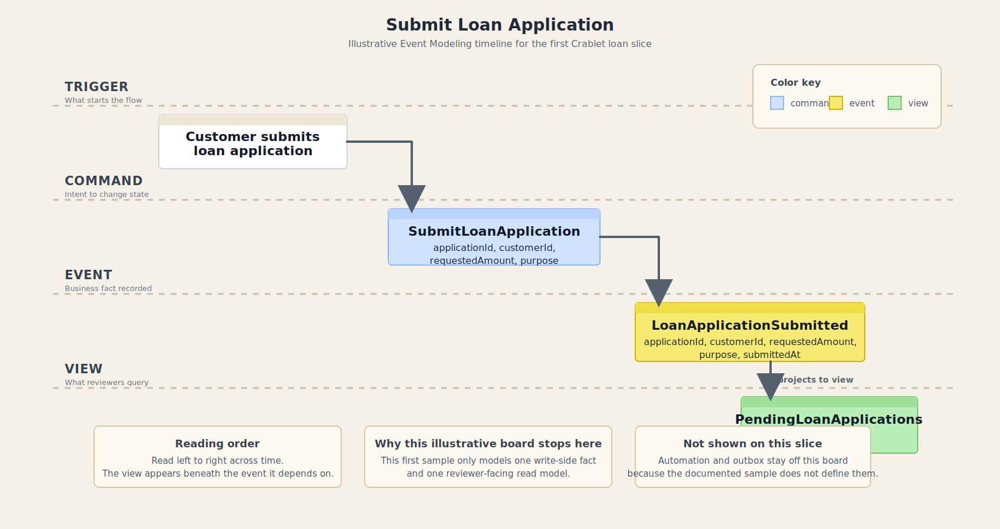

# Feature Slice Workflow

This guide describes the intended developer dialogue for adding one vertical slice with
`embabel-codegen`.

In normal app development, start from the
[Crablet app template](../templates/crablet-app/README.md) and use this workflow from inside the
cloned app.

A slice should be one observable user outcome, not a whole subsystem. For example:

- open a wallet
- deposit money
- approve a small loan automatically
- publish a notification when an application is rejected

## Prepare The Tooling

From the `spring-crablet` repository:

```bash
make install
make codegen-build
```

For generation, the shell running the tool needs:

```bash
export ANTHROPIC_API_KEY=sk-ant-...
```

For a greenfield app, initialize the project:

```bash
java -jar embabel-codegen/target/embabel-codegen.jar init \
  --name loan-service \
  --package com.example.loan \
  --dir ../loan-service
```

For a brownfield app, skip `init` and point `generate --output` at the existing
`src/main/java` root.

## Practical Walkthrough

For a loan application service, start with one feature: a customer submits an application and
reviewers can see it in a pending queue.

### Classic Event Modeling View

This same slice can be shown as a classic Event Modeling board with horizontal lanes:



The board intentionally stops at the `View` lane. For this first sample, the slice only needs:

- a trigger from the customer or API
- one command: `SubmitLoanApplication`
- one stored fact: `LoanApplicationSubmitted`
- one reviewer query model: `PendingLoanApplications`

That keeps the example aligned with the documented sample model. Automation and translation become
useful on later slices, such as auto-approval rules or outbound notifications.

The developer dialogue should stay outcome-oriented:

```text
I want to add the Submit Loan Application slice.

Outcome:
- a customer submits a loan application
- Crablet records LoanApplicationSubmitted
- reviewers can query pending applications

Model this as one Crablet slice.
Ask for missing facts before changing event-model.yaml.
```

The assistant should turn that into explicit model facts:

| Model fact | Example value |
|---|---|
| Command | `SubmitLoanApplication` |
| Event | `LoanApplicationSubmitted` |
| Command pattern | `idempotent` |
| Tags | `application_id`, `customer_id` |
| Required fields | `applicationId`, `customerId`, `requestedAmount`, `purpose` |
| Validation | non-blank IDs and purpose, `requestedAmount > 0` |
| Read model | `PendingLoanApplications` |

Before writing files, ask for a model review:

```text
Review the proposed event-model.yaml.
Does embabel-codegen have enough information to generate the command, event,
handler decision state, view projector, and migration without guessing?
```

Then ask for the plan:

```bash
java -jar embabel-codegen/target/embabel-codegen.jar plan \
  --model event-model.yaml
```

For this slice, the plan should name the event hierarchy, submit command, command handler,
state projector, query patterns, pending-applications projector, and Flyway migration.

Only after that plan looks right should you run `generate`. The intended loop is:

```text
model -> review -> plan -> generate -> verify -> refine the model
```

## Dialogue Shape

Use the assistant to keep the slice explicit before generating code.

```text
We are adding one Crablet vertical slice: submit a loan application.
Help me model only this slice.

Outcome:
- a customer submits an application
- the system records that fact
- reviewers can query pending applications

Ask for missing business facts before writing event-model.yaml.
```

The assistant should clarify:

- command name, fields, and validation
- event name, fields, and tags
- command pattern: `idempotent`, `commutative`, or `non-commutative`
- consistency check and guard events
- read model needed to observe the result
- automation or outbox behavior, if the slice needs one
- sample scenario used to verify the slice

For this example, the resulting model should look like
[loan-submit-feature-slice-event-model.yaml](examples/loan-submit-feature-slice-event-model.yaml).

Then ask it to update only the model:

```text
Update event-model.yaml for this slice only.
Keep existing slices intact.
Use the format in docs/EVENT_MODEL_FORMAT.md.
Do not invent external adapters or placeholder TODOs.
```

Before generation, run one model review:

```text
Review event-model.yaml against docs/EVENT_MODEL_FORMAT.md.
Tell me whether embabel-codegen has enough information to generate:
- events
- commands
- command handler decision state
- views
- automations
- outbox publishers
List missing model facts instead of guessing.
```

You can also ask `embabel-codegen` for the deterministic artifact plan without
calling Anthropic or writing files:

```bash
java -jar embabel-codegen/target/embabel-codegen.jar plan \
  --model event-model.yaml
```

From the `spring-crablet` repository, the shortest contributor smoke check for the
documented loan slice is:

```bash
make codegen-plan-example
```

After changing `embabel-codegen`, the event model format, or the documented fixture, run:

```bash
make codegen-check
```

Claude Code MCP path:

```text
Run embabel_plan with model=event-model.yaml.
```

## Detailed Claude Code Experience

This example shows the intended user experience once the template, Claude instructions, and
`embabel-codegen` MCP tools are wired together.

For the same flow as a standalone transcript, see
[Submit Loan Application Claude Dialogue](examples/submit-loan-application-claude-dialogue.md).

The developer starts from an initialized app:

```bash
cd ../loan-service
export ANTHROPIC_API_KEY=sk-ant-...
claude
```

The developer does not start by asking for Java classes. They describe one outcome and ask Claude to
model the slice first:

```text
User:
Add the first vertical slice: Submit Loan Application.

Outcome:
- a customer submits a loan application
- Crablet records LoanApplicationSubmitted
- reviewers can query pending applications

Use the Crablet feature-slice workflow.
Ask for missing facts before changing files.
```

Claude should keep the conversation at the domain-model level:

```text
Claude:
I will model this as one Crablet vertical slice before generating code.

I need a few business facts:

1. What uniquely identifies a loan application?
2. Should submitting the same application twice be idempotent, rejected, or treated as a new
   submission?
3. Which fields are required when the customer submits the application?
4. Should the submitted event include a timestamp supplied by the client, generated by the server,
   or omitted for this slice?
5. Which fields should reviewers see in the pending applications view?
6. Does this slice need any automation or external publishing?
```

The developer answers with business facts, not framework details:

```text
User:
applicationId uniquely identifies the application.

Submission should be idempotent. Submitting the same applicationId twice should not create a
different application.

Required command fields:
- applicationId
- customerId
- requestedAmount
- purpose

requestedAmount must be positive. IDs and purpose must not be blank.

The submitted event should include submittedAt as an Instant. The server can set it.

Reviewers should see:
- applicationId
- customerId
- requestedAmount
- purpose
- status
- submittedAt

No automation or outbox for this slice.
```

Claude summarizes the model before writing files:

```text
Claude:
Here is the proposed slice model.

Command:
- SubmitLoanApplication
- pattern: idempotent
- produces: LoanApplicationSubmitted
- fields: applicationId, customerId, requestedAmount, purpose
- validation: IDs and purpose are non-blank; requestedAmount > 0

Event:
- LoanApplicationSubmitted
- tags: application_id, customer_id
- fields: applicationId, customerId, requestedAmount, purpose, submittedAt

View:
- PendingLoanApplications
- reads: LoanApplicationSubmitted
- tag: application_id
- fields: applicationId, customerId, requestedAmount, purpose, status, submittedAt

Automations:
- none

Outbox publishers:
- none

I have enough information to update event-model.yaml for this slice. I will keep existing slices
intact and avoid adding placeholder adapters or TODOs.
```

Claude writes or updates `event-model.yaml`:

```yaml
# yaml-language-server: $schema=./event-model-schema.json
domain: LoanApplication
basePackage: com.example.loan

events:
  - name: LoanApplicationSubmitted
    tags: [application_id, customer_id]
    fields:
      - name: applicationId
        type: string
      - name: customerId
        type: string
      - name: requestedAmount
        type: integer
      - name: purpose
        type: string
      - name: submittedAt
        type: Instant

commands:
  - name: SubmitLoanApplication
    pattern: idempotent
    produces: [LoanApplicationSubmitted]
    fields:
      - name: applicationId
        type: string
        minLength: 1
      - name: customerId
        type: string
        minLength: 1
      - name: requestedAmount
        type: integer
        exclusiveMinimum: 0
      - name: purpose
        type: string
        minLength: 1

views:
  - name: PendingLoanApplications
    reads: [LoanApplicationSubmitted]
    tag: application_id
    fields:
      - name: applicationId
        type: string
      - name: customerId
        type: string
      - name: requestedAmount
        type: integer
      - name: purpose
        type: string
      - name: status
        type: string
      - name: submittedAt
        type: Instant

automations: []
outbox: []
```

Before generation, Claude asks the deterministic planner what will be produced:

```text
Claude:
event-model.yaml is updated. I will run the artifact plan now. This does not call the AI generator
or write Java files.
```

Claude Code MCP path:

```text
Tool:
embabel_plan model=event-model.yaml
```

Equivalent CLI path:

```bash
java -jar tools/embabel-codegen.jar plan --model event-model.yaml
```

Claude shows the plan to the developer and waits for approval:

```text
Claude:
The planned artifacts for this slice are:

Domain:
- com.example.loan.domain.LoanApplicationEvent
- com.example.loan.domain.LoanApplicationSubmitted

Command:
- com.example.loan.command.SubmitLoanApplication
- com.example.loan.command.SubmitLoanApplicationCommandHandler
- com.example.loan.command.LoanApplicationState
- com.example.loan.command.LoanApplicationStateProjector
- com.example.loan.command.LoanApplicationQueryPatterns

View:
- com.example.loan.view.PendingLoanApplicationsViewProjector
- db/migration/V100__create_pending_loan_applications.sql
- table: pending_loan_applications

No automation artifacts will be generated.
No outbox publisher artifacts will be generated.

Please review this before I generate code. The model currently describes only the submit slice.
```

If the plan is wrong, the developer corrects the model facts:

```text
User:
Use application_id as the only view routing tag. customer_id should stay on the event, but the view
should be keyed by application.
```

Claude updates `event-model.yaml`, reruns `embabel_plan`, and shows the revised plan. If the plan is
right, the developer approves generation:

```text
User:
Looks right. Generate it.
```

Claude invokes generation:

```text
Claude:
I will generate the structural code from event-model.yaml now.
```

Claude Code MCP path:

```text
Tool:
embabel_generate model=event-model.yaml output=src/main/java
```

Equivalent CLI path:

```bash
java -jar tools/embabel-codegen.jar generate \
  --model event-model.yaml \
  --output src/main/java
```

The generator runs the agent pipeline and compile-and-repair loop. Claude should report the result
in terms of the slice, not raw implementation noise:

```text
Claude:
Generated the Submit Loan Application slice.

Created or updated:
- LoanApplicationSubmitted event record
- LoanApplicationEvent sealed interface
- SubmitLoanApplication command record
- SubmitLoanApplicationCommandHandler
- LoanApplicationState and projector
- LoanApplicationQueryPatterns
- PendingLoanApplicationsViewProjector
- V100__create_pending_loan_applications.sql

The generator did not create automation or outbox code because the model has empty automations and
outbox sections.
```

Claude then verifies the target app:

```text
Claude:
I will run the application verification now.
```

```bash
./mvnw verify
```

If verification passes:

```text
Claude:
Verification passed.

The Submit Loan Application slice is complete for the generated structural path:
- the command validates required input
- the event is tagged for DCB and projections
- the handler has decision state
- the pending applications view has a projector and migration
- no unrelated automation or outbox artifacts were introduced
```

If verification fails because generated Java is structurally wrong, Claude should fix generated code
or rerun generation after improving the model. If the failure reveals a missing business rule, Claude
should push that fact back into `event-model.yaml` first:

```text
Claude:
The build failure is caused by a missing model fact: the command handler cannot decide whether a
submitted application is already terminal because the model has no approved or rejected events yet.

For this first slice, I can keep the idempotency check scoped to LoanApplicationSubmitted. If this
slice must also protect against already-approved or already-rejected applications, we should add
those events to the model before regenerating.
```

The developer chooses the business behavior:

```text
User:
Keep this first slice scoped to LoanApplicationSubmitted only. We will add approval and rejection in
later slices.
```

Claude adjusts the model or generated code within that boundary, reruns generation or repair, and
then reruns `./mvnw verify`.

The expected feeling of the workflow is:

```text
describe outcome
  -> answer missing business facts
  -> review event-model.yaml
  -> review generated artifact plan
  -> approve generation
  -> verify the app
  -> refine the model when behavior is missing
```

## Generate The Slice

CLI path:

```bash
java -jar embabel-codegen/target/embabel-codegen.jar generate \
  --model event-model.yaml \
  --output ../loan-service/src/main/java
```

Claude Code MCP path:

```text
Run embabel_generate with model=event-model.yaml and output=../loan-service/src/main/java.
```

The generator runs the agent pipeline for events, commands, views, automations,
and outbox publishers, then runs a compile-and-repair loop up to three times.

## Expected Generated Artifacts

For [loan-submit-feature-slice-event-model.yaml](examples/loan-submit-feature-slice-event-model.yaml),
the generated Java should target `com.example.loan`.

Expected domain artifacts:

- `com.example.loan.domain.LoanApplicationEvent`
- `com.example.loan.domain.LoanApplicationSubmitted`

Expected command artifacts:

- `com.example.loan.command.SubmitLoanApplication`
- `com.example.loan.command.SubmitLoanApplicationCommandHandler`
- `com.example.loan.command.LoanApplicationState`
- `com.example.loan.command.LoanApplicationStateProjector`
- `com.example.loan.command.LoanApplicationQueryPatterns`

Expected view artifacts:

- `com.example.loan.view.PendingLoanApplicationsViewProjector`
- a Flyway migration named `V100__create_pending_loan_applications.sql`
- a `pending_loan_applications` table with the fields from the view model

No automation or outbox classes should be generated for this slice because the model has
empty `automations` and `outbox` arrays.

The compile-and-repair loop may adjust generated Java details, but it should not invent
new commands, events, views, automations, or publishers that are absent from the model.

## Verify The Slice

Build the target app:

```bash
cd ../loan-service
./mvnw verify
```

If the build fails because generated Java is structurally wrong, repair the generated
code or rerun generation after improving the model. If the behavior is wrong because
a business fact was missing, update `event-model.yaml` first and regenerate.

For runtime verification, use the smallest observable check:

1. Submit the command.
2. Confirm the expected event was appended.
3. Query the view, if the slice defines one.
4. Confirm automation or outbox side effects, if the slice defines them.

## Slice Completion Criteria

A generated vertical slice is complete when:

- the command has validation and an explicit command pattern
- the event has stable tags for DCB checks and projections
- the command handler has enough decision state to avoid guessing
- any view has a table shape and projector source events
- any automation has a trigger, condition, and emitted command
- any outbox publisher has handled events, topic, and adapter boundary
- `./mvnw verify` passes in the target application

Keep manual edits for application-specific behavior that the model cannot express.
Push structural omissions back into `event-model.yaml`.
