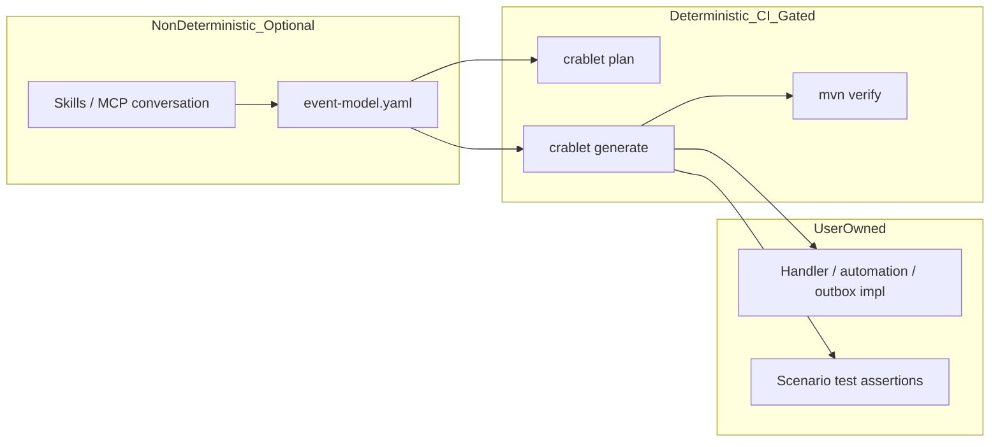

# AI Workflow Trust Hardening Plan

**Date:** 2026-07-02  
**Status:** Proposed (revised after review)  
**Related:** [deterministic-codegen-from-event-model.md](deterministic-codegen-from-event-model.md), [deterministic-codegen-assessment.md](deterministic-codegen-assessment.md), [AI_WORKFLOW_FEASIBILITY.md](../../user/ai-tooling/AI_WORKFLOW_FEASIBILITY.md)

## Review summary (2026-07-02)

Gap analysis and phase sequencing confirmed accurate. Revisions below resolve five review items: LLM client retention vs Phase 5, maintainer skill update, Spring startup verification, Phase 3 ownership classification, Phase 1 split, and `FileWriterTool` path-safety extraction.

## Implementation checklist

- [x] **Phase 1a — docs (unblocked):** Update AI/codegen docs; remove stale LLM-agent references; update maintainer skill
- [x] **Phase 1b — startup gate:** Add `@SpringBootTest` proving `CodegenApp` starts with no LLM credentials
- [x] **Phase 1c — dead code (after 1b):** Remove unused implementations; keep dormant LLM interface; extract path-safety from `FileWriterTool`
- [x] **Phase 2:** Add golden unit tests for `EventsGenerator`, `ViewsGenerator`, `AutomationsGenerator`, `OutboxGenerator` + DCB strategy variants
- [x] **Phase 3:** Implement `make codegen-regenerate-verify` using the loan snapshot ownership table below
- [x] **Phase 4:** Add `codegen-check` and `codegen-regenerate-verify` to `.github/workflows/maven.yml`
- [x] **Phase 5:** Document AI modeling as human-reviewed, non-CI scope; clarify scenario stub test expectations

**Prerequisites before execution:** Phase 1b must pass before Phase 1c. Phase 3 must not start until the loan ownership table is committed (done in this revision).

---

## Strategic boundary (what we are committing to)



**Worth implementing:** skills + YAML modeling loop, deterministic codegen, MCP tools.  
**Stop investing in:** LLM Java generation and repair loops (already removed from [`CodegenPipeline`](../../../crablet-codegen/src/main/java/com/crablet/codegen/pipeline/CodegenPipeline.java); legacy beans remain).

The durable contract is [`event-model.yaml`](../../user/examples/loan-submit-feature-slice-event-model.yaml). CI must prove `same YAML + same generator version = same output`, never live model calls.

---

## Current state (gap analysis)

| Area | Status | Gap |
|------|--------|-----|
| Default `generate` | Deterministic generators wired | Good |
| Generator unit tests | Only [`CommandsGeneratorTest`](../../../crablet-codegen/src/test/java/com/crablet/codegen/generator/CommandsGeneratorTest.java) | Events, views, automations, outbox untested |
| End-to-end proof | [`examples/loan-generated-snapshot`](../../../examples/loan-generated-snapshot/) compiles in CI | No regenerate-and-diff; snapshot may drift from generator silently |
| CI | [`codegen-snapshot-verify`](../../../Makefile) in [`.github/workflows/maven.yml`](../../../.github/workflows/maven.yml) | [`codegen-check`](../../../Makefile) (unit tests + plan smoke) **not** in CI |
| Legacy LLM path | [`RepairAgent`](../../../crablet-codegen/src/main/java/com/crablet/codegen/agents/RepairAgent.java), [`DirectLlmClient`](../../../crablet-codegen/src/main/java/com/crablet/codegen/llm/DirectLlmClient.java), [`TemplateLoader`](../../../crablet-codegen/src/main/java/com/crablet/codegen/tools/TemplateLoader.java) | `@Component`/`@Service` beans scanned but never injected; no `@SpringBootTest` today |
| User docs | [`AI_WORKFLOW_FEASIBILITY.md`](../../user/ai-tooling/AI_WORKFLOW_FEASIBILITY.md), [`crablet-codegen/README.md`](../../../crablet-codegen/README.md) | Still describe EventsAgent/RepairAgent pipeline |
| Maintainer skill | [`.claude/skills/crablet-maintainer/SKILL.md`](../../../.claude/skills/crablet-maintainer/SKILL.md) | Still says codegen agents depend on `CodegenLlmClient` |
| Migration versioning | [`ViewsGenerator`](../../../crablet-codegen/src/main/java/com/crablet/codegen/generator/ViewsGenerator.java) uses `V100`, `V101`… | Timestamp names deferred — diff gate must compare exact migration filenames |

---

## Resolved decisions

### LLM client retention (Issue 1)

**Decision:** Keep the **interface and config types** as a dormant, `@Internal` reserve for future opt-in commands (`crablet explain`, `crablet suggest`). **Remove implementations and call sites** that belonged to the old LLM Java-generation path.

| Keep (dormant) | Remove |
|----------------|--------|
| [`CodegenLlmClient`](../../../crablet-codegen/src/main/java/com/crablet/codegen/llm/CodegenLlmClient.java) interface | [`DirectLlmClient`](../../../crablet-codegen/src/main/java/com/crablet/codegen/llm/DirectLlmClient.java) |
| [`CodegenLlmProperties`](../../../crablet-codegen/src/main/java/com/crablet/codegen/llm/CodegenLlmProperties.java) (defaults only; `selection()` is lazy — not called at startup) | [`RepairAgent`](../../../crablet-codegen/src/main/java/com/crablet/codegen/agents/RepairAgent.java) |
| [`CodegenLlmSelection`](../../../crablet-codegen/src/main/java/com/crablet/codegen/llm/CodegenLlmSelection.java) | [`TemplateLoader`](../../../crablet-codegen/src/main/java/com/crablet/codegen/tools/TemplateLoader.java) |
| [`CodegenLlmPropertiesTest`](../../../crablet-codegen/src/test/java/com/crablet/codegen/llm/CodegenLlmPropertiesTest.java) | `FileWriterTool.writeGeneratedFiles` (LLM block parser) |

Annotate retained types with `@Internal` and a Javadoc note: reserved for opt-in Phase 5 commands, not used by default `generate`.

**Maintainer skill update (Phase 1a):** Replace "codegen agents depend on `CodegenLlmClient`" with:

- Default `generate` is deterministic; no LLM client involved.
- Opt-in future commands may depend on `CodegenLlmClient`; implementations must stay in `com.crablet.codegen.llm` with no provider SDKs on the classpath (existing ArchUnit rule).

### Spring startup safety (Issue 2)

**Decision:** Add an explicit gate before Phase 1c dead-code removal.

Add `CodegenAppContextTest` (or equivalent) under `crablet-codegen/src/test/`:

```java
@SpringBootTest(classes = CodegenApp.class)
class CodegenAppContextTest {
    @Test
    void contextLoadsWithoutLlmCredentials() { }
}
```

Run with **no** `ANTHROPIC_API_KEY`, `OPENAI_API_KEY`, or `codegen.llm.*` overrides. This proves the clean-checkout case and catches regressions if a future bean eagerly calls `CodegenLlmProperties.selection()`.

**Note:** Static analysis suggests startup already succeeds — all `@Value` fields on `CodegenLlmProperties` have defaults, and `DirectLlmClient.complete()` is the only caller of `selection()`. The test converts an assumption into a contract.

### Loan snapshot ownership for Phase 3 diff (Issue 3)

**Decision:** Phase 3 compares **only paths the current generators write today**, not everything `ArtifactPlanner` lists. Planner entries for `State`, `StateProjector`, and `QueryPatterns` are **planned** machine-owned artifacts but **not yet generated** — they stay out of the diff until generators exist.

For [`loan-submit-feature-slice-event-model.yaml`](../../user/examples/loan-submit-feature-slice-event-model.yaml) vs [`examples/loan-generated-snapshot`](../../../examples/loan-generated-snapshot/):

| Path | In regenerate diff? | Rationale |
|------|---------------------|-----------|
| `domain/LoanApplicationEvent.java` | **Yes** | `EventsGenerator` |
| `domain/LoanApplicationSubmitted.java` | **Yes** | `EventsGenerator` |
| `command/SubmitLoanApplication.java` | **Yes** | `CommandsGenerator` |
| `command/SubmitLoanApplicationCommandHandler.java` | **Yes** | `CommandsGenerator` |
| `view/PendingLoanApplicationsViewProjector.java` | **Yes** | `ViewsGenerator` |
| `resources/db/migration/V100__create_pending_loan_applications.sql` | **Yes** | `ViewsGenerator` (exact filename; defer timestamp migration rename) |
| `command/SubmitLoanApplicationHandler.java` | **No** | User-owned implementation |
| `command/LoanApplicationStateProjector.java` | **No** | Interim user-owned ([deterministic-codegen-from-event-model.md](deterministic-codegen-from-event-model.md)) |
| `command/LoanApplicationState.java` | **No** | Not generated yet |
| `command/LoanApplicationQueryPatterns.java` | **No** | Not generated yet |
| `command/LoanApplicationTags.java` | **No** | Hand-maintained; no generator |
| `LoanApplication.java` | **No** | App bootstrap (`init`), not `generate` |
| `src/test/**` | **No** | Scenario scaffolds user-owned after first write |

**One-time snapshot refresh:** Regenerated machine-owned files will include `// Generated by Crablet from event-model.yaml. Do not edit.` ([`JavaRenderSupport.GENERATED_HEADER`](../../../crablet-codegen/src/main/java/com/crablet/codegen/generator/JavaRenderSupport.java)). Update the committed snapshot when implementing Phase 3 so the diff gate starts from a known baseline.

### FileWriterTool path safety (Issue 5)

**Decision:** Before removing `writeGeneratedFiles`, extract shared path normalization and traversal rejection into a package-private helper used by `writeGeneratedFile` (and any future writers). Migrate [`FileWriterToolTest`](../../../crablet-codegen/src/test/java/com/crablet/codegen/tools/FileWriterToolTest.java) to assert traversal rejection on `writeGeneratedFile`. Then delete `writeGeneratedFiles` and LLM-block parsing tests.

---

## Phase 1a — Docs and skill updates (zero risk, ship first)

**Goal:** No contributor reads outdated "LLM writes Java" guidance.

**Update:**

- [`crablet-codegen/README.md`](../../../crablet-codegen/README.md) — generator pipeline matching `CodegenPipeline`; API key optional and only for future opt-in LLM commands
- [`docs/user/ai-tooling/AI_WORKFLOW_FEASIBILITY.md`](../../user/ai-tooling/AI_WORKFLOW_FEASIBILITY.md) — refresh verdict post-deterministic migration
- [`docs/user/ai-tooling/AI_FIRST_WORKFLOW.md`](../../user/ai-tooling/AI_FIRST_WORKFLOW.md) — remove `ANTHROPIC_API_KEY` from default generate path
- [`.claude/skills/crablet-codegen/SKILL.md`](../../../.claude/skills/crablet-codegen/SKILL.md) — repair-cycle → fix YAML/generator and re-run `generate`
- [`.claude/skills/crablet-maintainer/SKILL.md`](../../../.claude/skills/crablet-maintainer/SKILL.md) — codegen section per **LLM client retention** decision above

**Keep:** [`crablet-codegen/CLAUDE.md`](../../../crablet-codegen/CLAUDE.md) as the **shape contract** for generators (not runtime LLM prompts).

---

## Phase 1b — Spring startup smoke test (gate for dead code removal)

**Goal:** Prove CLI/MCP Spring context boots without LLM credentials.

- Add `CodegenAppContextTest` as described in **Spring startup safety** above
- Include in `make codegen-check` via existing `mvn test` in `crablet-codegen`

**Blocker:** Phase 1c must not merge until this test passes on a clean environment.

---

## Phase 1c — Remove dead LLM-codegen implementations (after 1b)

**Goal:** Stop scanning unused `@Component` beans; preserve dormant LLM interface for Phase 5.

**Remove:**

- `DirectLlmClient`, `RepairAgent`, `TemplateLoader`
- `FileWriterTool.writeGeneratedFiles` after path-safety extraction (see **FileWriterTool path safety**)

**Keep (dormant, `@Internal`):**

- `CodegenLlmClient`, `CodegenLlmProperties`, `CodegenLlmSelection`, `CodegenLlmPropertiesTest`

**Verify:** `CodegenAppContextTest` + full `make codegen-check` still pass.

---

## Phase 2 — Generator golden tests (offline, deterministic)

**Goal:** Test generation **logic**, not a one-off snapshot.

Add tests under `crablet-codegen/src/test/java/com/crablet/codegen/generator/` mirroring [`CommandsGeneratorTest`](../../../crablet-codegen/src/test/java/com/crablet/codegen/generator/CommandsGeneratorTest.java):

| Test class | Fixture | Key assertions |
|------------|---------|----------------|
| `EventsGeneratorTest` | Loan slice | Sealed root, record fields, `GENERATED_HEADER` |
| `ViewsGeneratorTest` | Loan slice view | `AbstractTypedViewProjector`, migration SQL, switch cases |
| `AutomationsGeneratorTest` | Course fixture | Metadata-only interface, no `@Component` |
| `OutboxGeneratorTest` | Course/wallet fixture | `OutboxPublisher` contract, `PublishMode` |

**Shared helper:** load fixtures from loan and course YAML under [`docs/user/examples/`](../../user/examples/).

**DCB coverage:** one test per append strategy (`idempotent`, `non-commutative`, `commutative`, `commutative` + `guardEvents`).

**Do not:** snapshot-test LLM outputs or prompt strings.

---

## Phase 3 — Regenerate-and-diff fidelity gate (highest value)

**Goal:** Prove the committed snapshot is reproducible, not just compilable.

Add Makefile target `codegen-regenerate-verify`:

```bash
1. make codegen-build
2. java -jar crablet-codegen.jar generate \
     --model docs/user/examples/loan-submit-feature-slice-event-model.yaml \
     --output $TMP/src/main/java
3. For each path in the loan ownership table (diff = Yes):
     diff committed file vs regenerated file; exit 1 on any mismatch
4. Normalize: strip trailing whitespace if needed; document normalization rules in the Makefile comment
```

Use the **loan snapshot ownership table** in **Resolved decisions** — no conditional "if" language.

**Optional follow-up:** second snapshot from course fixture (automations + outbox + multi-aggregate DCB) after loan gate is stable.

---

## Phase 4 — CI integration

**Goal:** Every PR runs offline codegen tests; no API keys.

Update [`.github/workflows/maven.yml`](../../../.github/workflows/maven.yml):

| Step | Target | Why |
|------|--------|-----|
| Add before snapshot verify | `make codegen-check` | Unit tests + plan smoke + `CodegenAppContextTest` |
| Add after snapshot verify | `make codegen-regenerate-verify` | Catches generator drift vs committed snapshot |
| Keep | `make codegen-snapshot-verify` | Proves generated app compiles + tests run against Crablet runtime |

Ensure [`validate-all`](../../../Makefile) includes `codegen-regenerate-verify` once Phase 3 lands.

---

## Phase 5 — AI modeling layer (explicit non-CI scope)

**Goal:** Clarify what AI features are product-worthy without test cost.

**In scope (no CI cost):**

- Skills: [`crablet-event-modeling`](../../../.claude/skills/crablet-event-modeling/SKILL.md), [`crablet-greenfield`](../../../.claude/skills/crablet-greenfield/SKILL.md), MCP `crablet_plan` / `crablet_generate`
- Human review gate: PRs diff `event-model.yaml`; `crablet_plan` before `crablet_generate`
- [`crablet_sync_scenarios`](../../../crablet-codegen/README.md) in app CI

**Out of CI / optional later:**

- Live diagram / `crablet watch` (H2 in [`PRODUCT_ROADMAP.md`](../PRODUCT_ROADMAP.md))
- Opt-in `crablet explain` / `crablet suggest` — wire through retained `CodegenLlmClient`; new `@Internal` implementation in `com.crablet.codegen.llm`

**Scenario stubs:** generated scenario tests are **structure only** until the user adds assertions.

---

## Success criteria

1. `make generate` requires no LLM API key on a clean [`templates/crablet-app`](../../../templates/crablet-app/) checkout
2. `CodegenAppContextTest` passes with no LLM env vars
3. `make codegen-check && make codegen-regenerate-verify && make codegen-snapshot-verify` passes offline
4. All five generators have unit tests covering at least one real fixture
5. No docs reference LLM agents as the default generate path; maintainer skill reflects deterministic default + dormant LLM interface
6. Dead implementations removed; `CodegenLlmClient` interface retained for Phase 5 opt-in commands

---

## Deferred (do not block this plan)

- Timestamp-based Flyway migration names in `ViewsGenerator` (would change diff filenames — separate PR)
- Deterministic `StateProjector` / `QueryPatterns` / `State` generation (blocked on YAML `state:` metadata)
- Migration drift detection between model and existing SQL
- Live diagram watcher (product UX; separate H2 track)
- Second snapshot app (course fixture)
