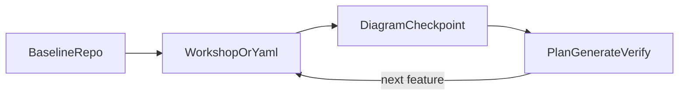

# Plan: Greenfield lifecycle skill (workshop → slices → evolving app)

_Saved from Cursor plan `7f47fac1-22e5-445a-a2a1-e72db153fecf`. Track implementation status in issues or the Cursor plan todo list._

## Revision notes (risk closure)

Planning review highlighted three gaps; this document now **requires**:

1. **Template skill verifier** — `make skills-check` runs [`scripts/check-template-skills.sh`](../../../scripts/check-template-skills.sh), which uses a fixed `SKILL_IDS` array and optional `grep_markers` checks, then asserts every id appears in [`templates/crablet-app/CLAUDE.md`](../../../templates/crablet-app/CLAUDE.md). **Implementation must extend that script for `crablet-greenfield`**, or CI can pass while the new skill is missing or hollow.
2. **Executable diagram preview for apps** — Root [`Makefile`](../../../Makefile) target `make event-model-diagrams` runs [`.github/scripts/generate-event-model-svgs.js`](../../../.github/scripts/generate-event-model-svgs.js), which renders **manifest-listed** YAML under [`docs/diagrams.manifest.json`](../../../docs/diagrams.manifest.json), not an arbitrary generated app’s `event-model.yaml`. **Do not** tell app authors that `make event-model-diagrams` alone previews *their* model. Implement a separate, **callable-from-app-repo** preview path (see below).
3. **Canonical vs template SKILL wording for Phase A** — The [`templates/crablet-app/Makefile`](../../../templates/crablet-app/Makefile) only exposes `plan` / `generate` / `k8s` / `verify`; the user reading the mirrored skill inside a **copied** app is already at app root. The **template-side** SKILL must foreground “confirm codegen jar, MCP/Makefile, `./mvnw verify`” and defer “clone Initializr / copy starter” appropriately to avoid implying they are still prepending bootstrap they already performed.

## Tracking todos

| ID | Task |
|----|------|
| `checker-template-skills` | Extend [`scripts/check-template-skills.sh`](../../../scripts/check-template-skills.sh): add `crablet-greenfield` to `SKILL_IDS`, add minimal `grep_markers` lines for canonical template SKILL content (as for other ids), confirm [`templates/crablet-app/CLAUDE.md`](../../../templates/crablet-app/CLAUDE.md) routing includes `/crablet-greenfield` |
| `diagram-preview-app-side` | Add an **explicit** preview mechanism for `./event-model.yaml` in a generated app (see “Diagram preview mechanism”). Wire a [`templates/crablet-app/Makefile`](../../../templates/crablet-app/Makefile) target (name TBD e.g. `diagram-preview`). Document prerequisites (Node + `js-yaml`, path to renderer, optional `CRABLET_ROOT`). |
| `add-skill-framework` | Author [`.claude/skills/crablet-greenfield/SKILL.md`](../../../.claude/skills/crablet-greenfield/SKILL.md) with split Phase A, phases B–D, evolution loop, diagram checkpoint tying to preview command, delegation table |
| `mirror-template-skills` | Add [`templates/crablet-app/.claude/skills/crablet-greenfield/SKILL.md`](../../../templates/crablet-app/.claude/skills/crablet-greenfield/SKILL.md) with **documented Phase A deltas** (“starter context” variant); align body otherwise with canonical |
| `diagram-workflow-crablet-app-dev` | Extend canonical + template **`crablet-app-dev`** Feature Slice Workflow: after YAML / model-affecting input → **diagram checkpoint** using the documented preview mechanism + `/crablet-diagram-advisor` when editing `diagram.*` |
| `routing-docs` | Update [`CLAUDE.md`](../../../CLAUDE.md), [`templates/crablet-app/CLAUDE.md`](../../../templates/crablet-app/CLAUDE.md), [`docs/user/ai-tooling/AI_SKILLS.md`](../../user/ai-tooling/AI_SKILLS.md); optional routing one-liners in canonical `crablet-app-dev` / `event-modeling` |
| `sanity-verify` | Run **`make skills-check`** after all template + script edits |

## Diagram preview mechanism (implementation contract)

Normative wording in skills (“surface the diagram”) needs a **deterministic hook**:

- **Reuse the renderer embedding pattern** from [`generate-event-model-svgs.js`](../../../.github/scripts/generate-event-model-svgs.js): inline [`docs/event-model-renderer.js`](../../../docs/event-model-renderer.js), parse YAML (`js-yaml`), assign `window.__MODEL__` / optional sidecar, call `EventModelRenderer.render`, write **standalone HTML**.
- **No Playwright required for interactive preview** (unlike CI SVG extraction): write e.g. `target/event-model-diagram-preview.html` or `diagram-preview.html` and instruct the developer to open it in a browser.
- **Where the implementation lives** (pick one coherent approach—decide at implementation time):
  - **A.** New small Node script under [`scripts/`](../../../scripts/) plus template Makefile target that invokes it with `MODEL=event-model.yaml` and resolves renderer via **`CRABLET_ROOT`** pointing at a cloned `spring-crablet` repo **or**
  - **B.** Vendor a pinned copy of `event-model-renderer.js` (+ script) under `templates/crablet-app/tools/` so apps are self-contained at the cost of drift (mitigate via `skills-check` or maintainer checklist).

Skills and [`crablet-app-dev`](../../../.claude/skills/crablet-app-dev/SKILL.md) should reference **`make diagram-preview`** (final name locked when implemented), not **`make event-model-diagrams`**, for **app YAML** checkpoints.

Keep **`make event-model-diagrams`** for **manifest-driven** SVGs in this repo unchanged unless a separate refactor is desired.

## Diagram checkpoint (cross-cutting workflow rule)

Whenever the user adds input that changes the evolving model—or **any time `event-model.yaml` is edited** toward a slice—the workflow should surface the **Event Modeling diagram** (HTML preview via the mechanism above **and/or** textual walk-through of lanes/actors) so the human can sanity-check the **full picture** before or alongside `plan` / `generate`.

- **Skills**: Use `/crablet-diagram-advisor` when diagram metadata (`diagram.*`), assignments, overlays, or renderer rules need fixing; tie vocabulary to [`docs/event-model-renderer.js`](../../../docs/event-model-renderer.js), [`EVENT_MODEL_FORMAT.md`](../../user/ai-tooling/EVENT_MODEL_FORMAT.md), and Event Modeling terminology.
- **Implementation placement**:
  - **[`.claude/skills/crablet-app-dev/SKILL.md`](../../../.claude/skills/crablet-app-dev/SKILL.md)** — Add an explicit numbered step after model updates / each model-affecting turn: regenerate or open **`make diagram-preview` output**, spot-check assignments, **then** `plan`.
  - **`crablet-greenfield`** — Phases B, optional pre-generate gate in C, and each D iteration repeat the checkpoint.

This is **normative app development workflow**, not workshop-only behavior.

## Skill design (`crablet-greenfield`)

**New files**

- [`.claude/skills/crablet-greenfield/SKILL.md`](../../../.claude/skills/crablet-greenfield/SKILL.md): **canonical** (framework repo maintainers **and** narration of paths that include cloning this repo).
- [`templates/crablet-app/.claude/skills/crablet-greenfield/SKILL.md`](../../../templates/crablet-app/.claude/skills/crablet-greenfield/SKILL.md): mirror with **`### Phase A — App baseline (starter / copied application)`** variant (see below).

**Frontmatter**: `name: crablet-greenfield`, description covering bootstrap, workshop + slices, evolving app (views/automations/outbox), diagram checkpoints.

**Body structure**

1. **When to use** — Full journey pacing vs jumping straight into `/event-modeling` or `/crablet-app-dev`.
2. **Routing table** → `event-modeling`, `crablet-app-dev`, `crablet-diagram-advisor`, `dcb`, `crablet-codegen`, `crablet-local-dev`, optional `crablet-k8s`.
3. **Phase A (split)**

   **Canonical skill (spring-crablet workspace or greenfield narration)**

   - **Preferred**: Copy [`templates/crablet-app`](../../../templates/crablet-app/README.md); install framework jars per [`CREATE_A_CRABLET_APP.md`](../../user/CREATE_A_CRABLET_APP.md) / [`BUILD.md`](../../user/BUILD.md) when artifacts are unpublished.
   - **Alternative**: Spring Initializr + manual wiring (`spring init`, `curl` to `start.spring.io`) from **CREATE_A_CRABLET_APP**.
   - Outcome: runnable app boundary, Postgres, MCP vs Makefile discoverability (`make plan` / `make generate` / `make verify`).

   **Template mirror (user already holds a generated app checkout)**

   - Assume repo root `./` equals the starter app: `tools/embabel-codegen.jar` (or overridden `CRABLET_CODEGEN_JAR`), MCP or Makefile codegen per template README; `./mvnw verify` succeeds.
   - **Do restate** cloning spring-crablet vs Initializr only as “if you landed here without starter, see canonical Phase A docs,” not as the default storyline.

4. **Phase B — Model** — `/event-modeling` or controlled YAML edits; after increments → diagram checkpoint (**`make diagram-preview`** + advisory skill as needed).

5. **Phase C — Land one slice** — `/crablet-app-dev` loop; diagram checkpoint gate when actors/lanes/policies change materially.

6. **Phase D — Evolving app** — Each feature repeats B→C semantics; emphasize poller-backed modules, [`DEPLOYMENT_TOPOLOGY.md`](../../user/DEPLOYMENT_TOPOLOGY.md), `/dcb`.

7. **Optional** — `crablet-codegen`, `crablet-local-dev`, `crablet-k8s`.

## Routing and discoverability edits

| File | Change |
|------|--------|
| [`CLAUDE.md`](../../../CLAUDE.md) | Routing bullet `/crablet-greenfield`. |
| [`templates/crablet-app/CLAUDE.md`](../../../templates/crablet-app/CLAUDE.md) | Same; required for **`check-template-skills.sh` substring checks**. |
| [`docs/user/ai-tooling/AI_SKILLS.md`](../../user/ai-tooling/AI_SKILLS.md) | Table row + closing paragraph tweaks. |

**Cross-links**: `crablet-app-dev` routing mentions `crablet-greenfield`; optional `event-modeling` footer for handoffs.

Mirror policy: Template copies only where mirrored skills exist today; **every** mirrored file including new greenfield SKILL stays subject to **`make skills-check`**.

## What we intentionally skip

- **No generic “agents” subsystem** beyond existing skills-driven flows.
- **No replacement** for manifest SVG CI (`make event-model-diagrams`) unless optionally refactored later.

## Verification (after implementation)

- **`make skills-check`** passes **after** `SKILL_IDS` + markers + **`/crablet-greenfield`** CLAUDE substring checks.
- `make diagram-preview` (final name TBD) works from **`templates/crablet-app`** against default `event-model.yaml` fixtures.
- `crablet-app-dev` numbered workflow names diagram checkpoint explicitly.
- Optional: **`make validate-all`** if bundled with wider maintainer QA.
