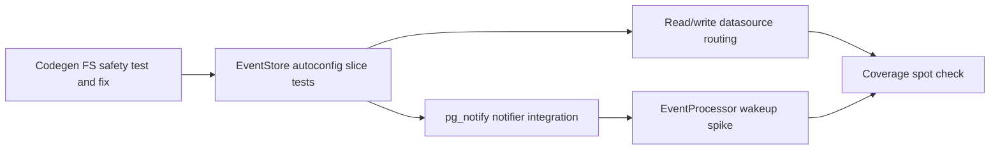

# Top 5 ROI: Improve Test Coverage

## Context

The repository already has strong integration depth in `crablet-eventstore` and
`crablet-event-poller`: EventStore integration suites, DCB/query helpers,
SharedFetch integration tests, state-machine tests, and management E2E coverage.
The highest ROI is not adding more broad end-to-end tests on already-covered
paths. It is closing holes around wiring, cross-boundary behavior, filesystem
safety, and ops-sensitive wakeup behavior.

JaCoCo is wired in the parent `pom.xml`, but coverage review needs one caveat:
`embabel-codegen` is currently excluded from the root reactor, so root-level
`./mvnw test` and aggregate coverage do not exercise or report that module
unless it is built separately or added to the reactor.

## 1. Codegen Filesystem Safety Tests and Fix

**Gap:** `embabel-codegen/src/main/java/com/crablet/codegen/tools/FileWriterTool.java`
resolves generated `===FILE: path===` blocks under `outputDir`, but it does not
currently enforce that the normalized target remains inside `outputDir`.
Generated paths such as `../escape.java` can write outside the configured output
root.

**Add:**

- Temporary-directory tests for `FileWriterTool`.
- A test that rejects `..` path traversal.
- A test that rejects absolute paths.
- A test that confirms normal nested relative paths still write successfully.
- A test documenting overwrite/idempotency behavior when the same file block is
  emitted twice.

**Implementation note:** Fix `FileWriterTool` so each normalized target must
`startsWith(outputDir.toAbsolutePath().normalize())` before writing.

**Why ROI:** Codegen writes into user trees. A filesystem escape is a real safety
bug, not just a coverage gap. Tests are pure Java and require no LLM calls.

## 2. EventStore Auto-Configuration Slice Tests

**Gap:** `crablet-eventstore/src/main/java/com/crablet/eventstore/config/EventStoreAutoConfiguration.java`
wires read replica selection, `PostgresNotifyEventAppendNotifier`,
`EventStoreImpl`, `JdbcTemplate`, and `PlatformTransactionManager`. There is no
dedicated `EventStoreAutoConfigurationTest` today.

**Add:** Prefer Spring Boot `ApplicationContextRunner` tests over full
`@SpringBootTest`.

- Default context creates `EventStore`, `EventAppendNotifier`, `WriteDataSource`,
  `ReadDataSource`, `JdbcTemplate`, and `PlatformTransactionManager`.
- Default notifier is `PostgresNotifyEventAppendNotifier`, matching the current
  always-enabled default notification behavior.
- Default `ReadDataSource` wraps the same datasource as `WriteDataSource`.
- `crablet.eventstore.read-replicas.enabled=true` with missing or blank URL
  fails fast with the `IllegalStateException` from `readDataSource(...)`.
- Replica enabled with a second Postgres datasource URL proves
  `ReadDataSource.dataSource()` is not the same instance as
  `WriteDataSource.dataSource()`.

**Why ROI:** Mis-wiring here breaks every app at runtime. Slice tests are fast
and deterministic compared to full-stack E2E tests.

## 3. PostgreSQL `pg_notify` Notifier Integration Test

**Gap:** `crablet-eventstore/src/main/java/com/crablet/eventstore/notify/PostgresNotifyEventAppendNotifier.java`
has no dedicated test. It is small, but it is core to event append wakeups.

**Add:** A direct Testcontainers-based integration test for
`PostgresNotifyEventAppendNotifier`.

- Open a `LISTEN crablet_events` connection.
- Call `notifyEventsAppended()`.
- Assert a notification is received with the default payload
  `events-appended`.
- Add a separate best-effort failure test with a datasource that throws
  `SQLException`, asserting `notifyEventsAppended()` does not propagate.

**Optional follow-up:** In `EventStoreImpl`, use a mock `EventAppendNotifier` to
assert successful append calls `notifyEventsAppended()` once. Keep this separate
from the direct PostgreSQL notification test.

**Why ROI:** This path powers LISTEN/NOTIFY wakeups and scale-to-zero polling.
It is easy to regress silently because notification failures are intentionally
best effort.

## 4. Read vs Write DataSource Routing in EventStoreImpl

**Gap:** `crablet-eventstore/src/test/java/com/crablet/eventstore/internal/EventStoreImplTest.java`
currently passes the same datasource for read and write. Production can use
distinct pools when read replicas are configured.

**Add:** A narrow test using tracking datasource wrappers around the same
underlying Postgres datasource.

- `exists(...)` and projection/query-style read operations acquire connections
  from the read datasource.
- Appends and transaction internals acquire connections from the write
  datasource.

**Implementation note:** Prefer connection-counting or datasource-call tracking
over brittle SQL substring matching. The behavior under test is which datasource
is asked for a connection.

**Why ROI:** Replica routing bugs are painful in production and invisible when
tests always configure read and write as the same datasource.

## 5. EventProcessorImpl Wakeup and Lifecycle Spike

**Gap:** `crablet-event-poller/src/main/java/com/crablet/eventpoller/internal/EventProcessorImpl.java`
contains leader retry cooldown, startup delay, `immediateRunRequested`,
shutdown guards, and `ProcessorWakeupSource` integration. Existing tests cover
processing behavior but do not deeply exercise wakeup and lifecycle branches.

**Add only if it can be deterministic:**

- A unit-style test with a fake `TaskScheduler` and a test
  `ProcessorWakeupSource` that captures the callback passed to `start(...)`.
- Invoking the captured wakeup callback schedules enabled processors with zero
  delay instead of waiting for the polling interval.
- Shutdown closes the wakeup source, releases leadership, clears scheduler
  state, and ignores wakeups afterward.

**Avoid:** Real sleeps or timing-sensitive Awaitility tests for cooldown behavior
unless a deterministic scheduler/clock seam is already available.

**Why ROI:** This class is concurrency and ops-sensitive. Regressions show up as
stalled processors or wake storms, but flaky timing tests would cost more than
they return.

## Suggested Implementation Order



Start with codegen filesystem safety and EventStore auto-configuration. They are
fast, concrete, and likely to produce stable tests. Then add direct
`pg_notify` coverage and read/write routing. Treat `EventProcessorImpl` wakeup
coverage as a spike: keep it only if the test can be made deterministic without
real timing.

## Verification

- Run root reactor tests for covered modules:

  ```bash
  ./mvnw test
  ```

- Run `embabel-codegen` separately because it is excluded from the root reactor:

  ```bash
  ./mvnw -f embabel-codegen/pom.xml test
  ```

- For JaCoCo aggregate review, use `verify`, then inspect changed-line coverage
  for `EventStoreImpl`, `EventStoreAutoConfiguration`, notifier classes, and
  `EventProcessorImpl`:

  ```bash
  ./mvnw verify
  ```
