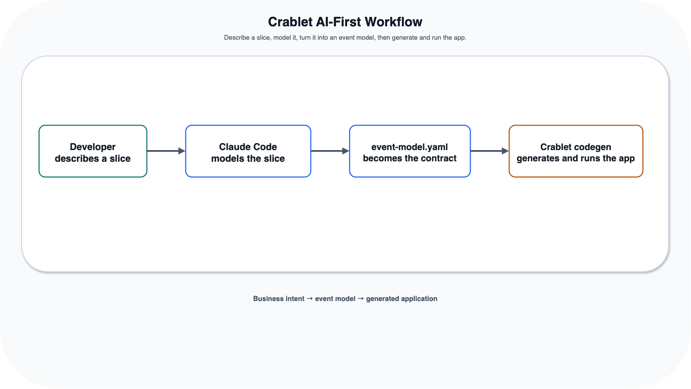
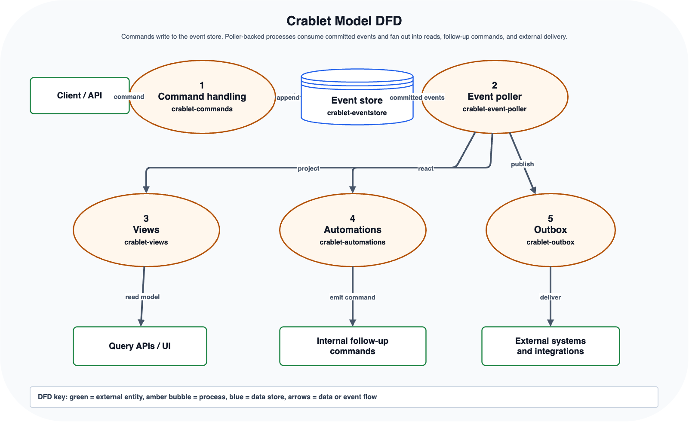

# AI-First Workflow

Crablet's AI-first direction is not "generate Java from a prompt" directly. The goal is a two-step
tooling loop:

1. Use AI tooling to turn Event Modeling workshop output, or a deliberately scoped subset of it,
   into an explicit `event-model.yaml`.
2. Use `event-model.yaml` as the source of truth for generating structural Spring application code.

In other words, people first describe the feature through Event Modeling language: outcomes,
commands, events, views, policies, automations, integrations, and sidecar notes. Those sidecars
include BDD scenarios for generated test scaffolding and decision/DCB expectations such as command
stereotypes (`commutative`, `non-commutative`, `idempotent`), guard events, and single- or
multi-entity consistency-boundary notes. The AI assistant helps translate that workshop material
into a reviewable YAML model. The code generator then consumes that model. This keeps the durable
artifact in the repository as structured domain data instead of an unrepeatable conversation
transcript.

The Java runtime APIs remain available, but they are the substrate for generated applications and
the manual path for teams that want direct control.

This workflow is currently a preview direction while the generator matures.

For application teams, the intended first-user path is to clone the
[Crablet app template](../../../templates/crablet-app/README.md), open Claude Code or Cursor,
describe one vertical slice using Event Modeling workshop language, let the assistant update
`event-model.yaml`, and then generate code from that file. Codex and other agents can use the same
Makefile/CLI workflow.
When using Claude Code, start prompts with the relevant skill name for predictable routing, for
example `/crablet-greenfield`, `/event-modeling`, or `/crablet-codegen`; see
[AI Skills](AI_SKILLS.md).

## At A Glance

### Generation Flow



### Crablet Model DFD



## Workflow

1. Build the Crablet runtime and `embabel-codegen` tool.
2. Optionally initialize a new Spring Boot application.
3. Run an Event Modeling workshop for one feature slice, or select a small subset from a larger
   workshop board: the business outcome, command, event, rules, read models, automations,
   integration outputs, BDD scenarios, and decision/DCB expectations.
4. Use AI tooling to translate that workshop output into `event-model.yaml` using the
   [Event Model Format](EVENT_MODEL_FORMAT.md).
   The file is the **single structural source**: docs diagrams are **projected** from it plus thin
   optional `diagram:` metadata (see **Diagram projection** in the format doc)—no parallel canvas to
   maintain for v1. Add optional `scenarios` during modeling to get generated JUnit 5 test
   scaffolding.
5. Review the YAML as the durable domain contract. If the assistant misunderstood the feature,
   fix the model before generating code.
6. Generate the Spring application code from `event-model.yaml`.
7. Compile the generated app.
8. Repair generation issues until the app builds.
9. Run the app on the Crablet runtime.
10. Update the event model when missing behavior is structural, and customize code when behavior is
   genuinely application-specific.

The intended shape when using Claude Code or Cursor through MCP:

```text
1. make install && make codegen-build
2. cp -r templates/crablet-app ../wallet-service
   cp embabel-codegen/target/embabel-codegen.jar ../wallet-service/tools/
3. cd ../wallet-service && export ANTHROPIC_API_KEY=sk-ant-... && claude
4. Provide one workshop slice/subset → assistant updates event-model.yaml → embabel_plan → approve → embabel_generate
5. ./mvnw verify
```

CLI shortcut (from the app directory; useful for Codex, other agents, and terminal workflows):

```bash
# one-time setup (from the spring-crablet repo):
make install && make codegen-build
cp -r templates/crablet-app ../wallet-service
cp embabel-codegen/target/embabel-codegen.jar ../wallet-service/tools/

# day-to-day (from the app directory):
make plan      # dry run — shows planned artifacts without generating code
make generate  # generate structural code from event-model.yaml
make verify    # compile and test
make check     # plan + verify in one step
```

For greenfield apps without the template, `init` has no Makefile shortcut — use the CLI directly:

```bash
java -jar embabel-codegen/target/embabel-codegen.jar init \
  --name wallet-service \
  --package com.example.wallet \
  --dir ../wallet-service
```

The generator should produce compiling, structurally complete code from `event-model.yaml`. Missing
behavior should be captured in the event model rather than left as framework boilerplate TODOs.

For the recommended developer dialogue around a single feature, see
[Feature Slice Workflow](FEATURE_SLICE_WORKFLOW.md). For Event Modeling notation and example
boards, see [Event Modeling](EVENT_MODELING.md). For a concrete generated-slice input, see
[loan-submit-feature-slice-event-model.yaml](../examples/loan-submit-feature-slice-event-model.yaml).
For a concise map of the Claude Code skills used by this workflow, see [AI Skills](AI_SKILLS.md).

## Tool Entrypoints

`embabel-codegen` is built as a fat JAR. From the `spring-crablet` repository:

```bash
make codegen-build
java -jar embabel-codegen/target/embabel-codegen.jar help
```

When working inside a project initialized from the template, use the Makefile shortcuts instead:

```bash
make plan      # embabel-codegen plan
make generate  # embabel-codegen generate
make verify    # ./mvnw verify
make check     # plan + verify
```

The CLI commands are:

- `init`: bootstrap a Spring Boot app with Crablet dependencies
- `plan`: print planned artifacts without calling a model or writing files
- `generate`: read `event-model.yaml`, generate code, and run the compile-and-repair loop

For the documented loan-slice fixture, contributors can run the local planner smoke check:

```bash
make codegen-plan-example
```

After changing `embabel-codegen`, the event model format, or the documented fixture, run:

```bash
make codegen-check
```

Claude Code can use the same tool through MCP when `.claude/settings.json` is active. Cursor can use
the same tool when `.cursor/mcp.json` is active:

- `embabel_init`
- `embabel_plan`
- `embabel_generate`

Generation uses the provider configured for `embabel-codegen`: Anthropic by default, OpenAI with
`CODEGEN_LLM_PROVIDER=openai`, or local/OpenAI-compatible endpoints such as Ollama with
`CODEGEN_LLM_PROVIDER=openai-compatible`, `CODEGEN_LLM_BASE_URL`, and `CODEGEN_LLM_MODEL`.

## What The Model Should Drive

A sufficiently rich event model should drive:

- event records and sealed event interfaces
- command records and validation
- command handlers and DCB append decisions
- state projectors used by command decisions
- materialized view projectors and SQL migrations
- automations that react to events and emit commands
- outbox publishers for integration events
- focused test scaffolding from model scenarios

The model must be explicit about types, tags, command patterns, validations, views, automation
conditions, and external adapters. The generator should fail early when the model is ambiguous
instead of guessing.

For the current preview contract, see [Event Model Format](EVENT_MODEL_FORMAT.md).

## What Still Belongs Outside Generation

The generator should not pretend to infer business facts that are not in the model.

Keep these explicit:

- business rules that the model does not describe
- external system credentials and endpoints
- deployment topology and operational choices
- domain-specific integration code behind generated adapters

When generated code exposes a missing rule, prefer improving `event-model.yaml` over editing around
structural gaps by hand.

## Runtime Relationship

Generated applications target the same runtime modules documented elsewhere in this repository:

- [Event Store](../../../crablet-eventstore/README.md)
- [Commands](../../../crablet-commands/README.md)
- [Views](../../../crablet-views/README.md)
- [Automations](../../../crablet-automations/README.md)
- [Outbox](../../../crablet-outbox/README.md)
- [Command Web API](../../../crablet-commands-web/README.md)
- [Micrometer metrics](../../../crablet-metrics-micrometer/README.md)

These APIs are still useful when generated code needs customization or when you choose the manual
runtime path.

## Current Manual Path

Until the generator is ready for primary use, the stable path is still:

- run the wallet reference app with [Quickstart](../QUICKSTART.md)
- build a new app manually with [Create A New Crablet App Manually](../CREATE_A_CRABLET_APP.md)
- learn the runtime concepts through the [Tutorial](../TUTORIAL.md)

The manual path should remain fully documented. The AI-first path changes the product center of
gravity, but it does not remove the need for clear runtime references.
