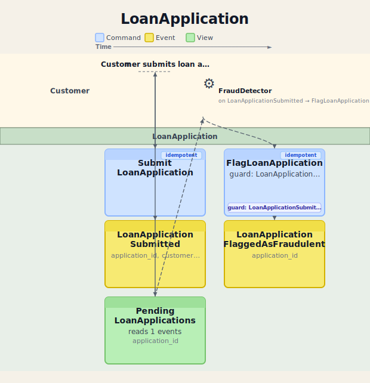
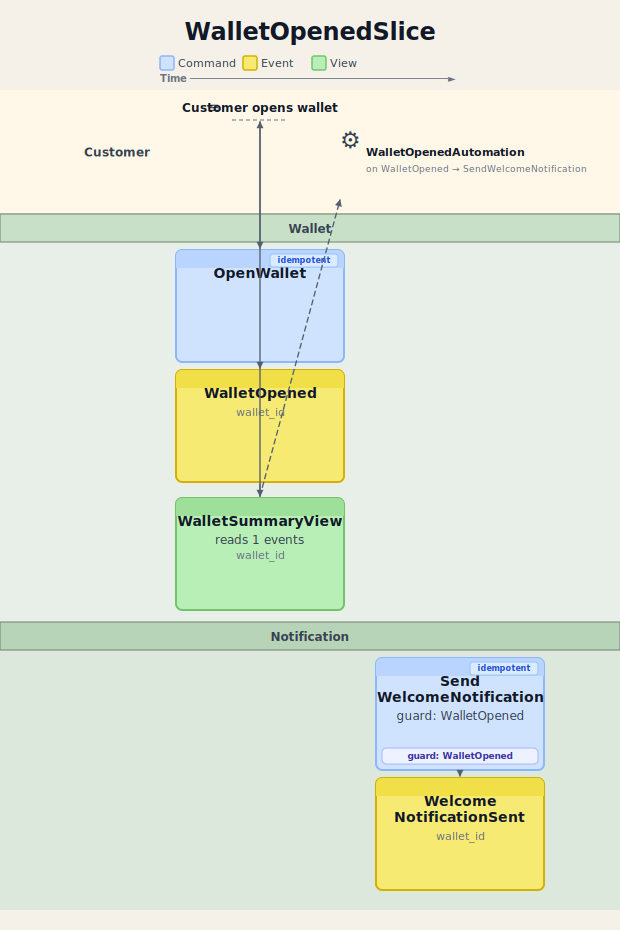

# Event Modeling

This page is the reference for how Crablet uses Event Modeling in documentation and feature-slice
workflows.

## Core Rule

Event Modeling is a horizontal timeline.

- time flows left to right
- lanes are semantic layers such as trigger, command, event, view, automation, and translation
- the board should not be drawn as a top-to-bottom flowchart

In Crablet docs, Event Modeling boards are used to explain feature slices before or alongside
`event-model.yaml`. They are a modeling aid, not a replacement for the YAML contract in
[Event Model Format](EVENT_MODEL_FORMAT.md).

## How To Read The Boards

Read the event lane from left to right as the timeline of business facts.

Other lanes sit above or below that timeline to show:

- what triggered the flow
- which command caused a fact to be recorded
- which views project from an event
- which automations wake up on an event
- which follow-up commands or translations happen downstream

In Crablet, those downstream consequences are normally asynchronous and poller-backed. A stored
event is committed first; views, automations, and outbox publication observe that committed event
later rather than participating in the synchronous command transaction.

When a board is illustrative rather than exhaustive, the docs should say so explicitly.

## Example Boards

### Minimal Slice

The first loan slice shows the smallest useful board: trigger, command, event, and one read model.

This board is intentionally limited to the first observable outcome. It does not add automation or
outbox behavior because that sample does not define them. The view shown there is an asynchronous
projection from the committed event.

Source context:
- [Feature Slice Workflow](FEATURE_SLICE_WORKFLOW.md)
- [loan-submit-feature-slice-event-model.yaml](../examples/loan-submit-feature-slice-event-model.yaml)

### Reactive Slice

The wallet board shows a richer slice where one committed event fans out into:

- a query view
- an automation
- a follow-up command and follow-up event
- an illustrative outbox publication path

The outbox branch in this board is intentionally illustrative. It is drawn from `WalletOpened` to
match the sample’s teaching goal, not to claim that every later event consequence is shown. The
view, automation, and outbox lanes all represent asynchronous poller-backed work that happens after
`WalletOpened` is stored.

Source context:
- [Feature Slice Workflow](FEATURE_SLICE_WORKFLOW.md)
- [Wallet Example App](../../../wallet-example-app/README.md)

## Relationship To Other Docs

- [Feature Slice Workflow](FEATURE_SLICE_WORKFLOW.md) is the hands-on guide that uses these boards
  in context
- [AI-First Workflow](AI_FIRST_WORKFLOW.md) explains the overall generation loop
- [Event Model Format](EVENT_MODEL_FORMAT.md) defines the YAML contract consumed by codegen
