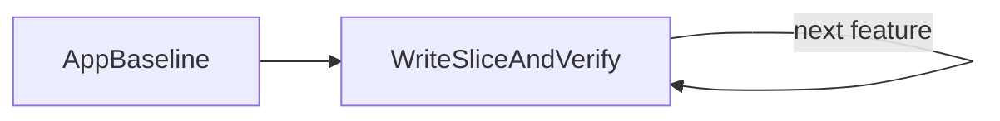

# Crablet Greenfield

This skill is the entry point when the user wants the whole journey paced from this generated app
root. It coordinates existing depth skills; it does not replace their playbooks.

## Routing

| Phase | Use |
|-------|-----|
| App baseline and local setup | `crablet-greenfield`, then `crablet-local-dev` if local setup fails |
| Slice implementation (handlers, views, automations, outbox) | `crablet-app-dev` |
| DCB pattern, tags, guard events, concurrency diagnosis | `crablet-dcb` |
| Local Kubernetes, once needed | `crablet-k8s` (pré-1.0/experimental) |

An AI-assisted codegen path (`event-model.yaml` workshop → generated structural code) exists as
a separate, pré-1.0/experimental track — see `crablet-event-modeling`, `crablet-codegen`. It is
optional; this skill's default path is manual Java.

## Phase A - App Baseline

Assume the current repo root is the starter app. Do not restart the bootstrap narrative unless the
user says they skipped the template.

Phase A is done when:

- `./mvnw verify` can run from this app root

If the user landed here without copying the starter, use the canonical spring-crablet docs:
`docs/user/CREATE_A_CRABLET_APP.md`, `docs/user/BUILD.md`, and `templates/crablet-app/README.md`.

## Phase B - Land One Slice

Use `crablet-app-dev` for the feature-slice loop:

1. Clarify the outcome and missing business facts.
2. Write the command, event(s), handler, and (if needed) view/automation/outbox by hand.
3. Write handler/view/automation tests.
4. Run `./mvnw verify`.

## Phase C - Evolve The App

Treat every new capability as another vertical slice. Return to Phase B for the next command,
view, automation, or outbox publisher.

When adding views, automations, or outbox, confirm the required Maven modules and runtime
wiring. Poller-backed modules process at least once, so views, automations, and publishers must be
idempotent. For production topology, use the spring-crablet `docs/user/DEPLOYMENT_TOPOLOGY.md` rule:
command-only apps scale horizontally, while poller-backed modules need the documented
singleton-worker shape.

Use `crablet-dcb` whenever command consistency, tags, `guardEvents`, or conflict behavior are not obvious.

